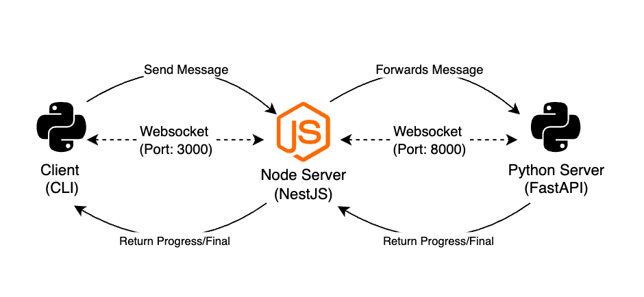

# Node ↔ Python Real-time Bridge

A minimal architecture that bridges a NestJS server and a FastAPI server over WebSockets, with a simple Python CLI client. The Node server relays real-time progress and final results from Python back to the client.

## Architecture Diagram

## Technical Design

- Protocol: WebSocket end-to-end for true streaming (no polling, no task IDs).
- Node (NestJS):
  - Hosts a WebSocket gateway at `ws://<host>:3000/ws`.
  - On client message `{ "text": "..." }`, opens a WebSocket to Python (`PYTHON_WS_URL`), forwards the text, and relays messages back.
  - Cleans up Python socket when the client disconnects.
- Python (FastAPI):
  - Hosts a WebSocket endpoint at `/ws`.
  - On receiving text, sends progress updates every second and then a final result (mock AI logic: uppercase transformation).
- Why WebSockets:
  - Simple, low-latency, bi-directional streaming.
  - Minimal dependencies and friction for dev testing.

## Technical Decisions

- Why Two WebSocket Layers:
  Using two WebSocket layers—Client ↔ Node and Node ↔ Python—creates a clean separation between presentation, orchestration, and computation. The Node layer acts as a bridge: it handles client sessions, validation, and lifecycle management while streaming messages to and from Python in real time.

- Why NestJS:
  NestJS was chosen because it offers a predefined and opinionated architecture - modules, dependenct injection, and decorators - allowing immediate scalability without manually crafting folder structures or middleware wiring as in bare Express.

## Folder Structure

- `node/` NestJS server (WebSocket Gateway)
  - `src/app.module.ts` — Root module; wires `ConfigModule`, `WebsocketGateway`, and `PythonService`.
  - `src/main.ts` — Application bootstrap.
  - `src/app.controller.ts` / `src/app.service.ts` — Sample controller/service.
  - `src/modules/websocket/websocket.gateway.ts` — WebSocket gateway entry point (`/ws`), proxies to Python.
  - `src/modules/integrations/python.services.ts` — Integration service that creates and manages the Python WebSocket connection.
  - `src/common/helpers/message.ts` — Centralized message types and helpers for building/parsing payloads.
  - `src/test/` — e2e tests and Jest config.
  - `.env.example` — Example environment config for Node (includes `PYTHON_WS_URL`).
  - `eslint.config.mjs`, `.prettierrc` — Linting/formatting configuration.
  - `package.json` — Scripts and dependencies.
- `python/` FastAPI server (WebSocket)
  - `app.py` — WebSocket endpoint at `/ws`; emits progress and final messages.
  - `requirements.txt` — Python dependencies.
- `client/` Python CLI client (websocket-client)
  - `client.py` — Sends a text payload and prints streaming responses.
  - `.env.example` — Example environment config for client.
  - `requirements.txt` — Python dependencies.
- `docker-compose.yml` — Orchestrates Node and Python services.
- `architecture.png` — System architecture diagram.
- `README.md` — Project documentation.

## How to Run

#### Run locally (pnpm)

- Start Python (in `python/`):
  - Create virtual environment: `python -m venv .venv`
  - Activate the virtual environment: `source .venv/bin/activate`
  - Install dependencies: `pip install -r requirements.txt`
  - Run Python server: `uvicorn app:app --host 0.0.0.0 --port 8000`
- Start Node (in `node/`):
  - Install dependencies: `pnpm install`
  - Run Node server: `pnpm run start` (or `pnpm run start:dev`)
- Run client (in `client/`):
  - Create virtual environment: `python -m venv .venv`
  - Activate the virtual environment: `source .venv/bin/activate`
  - Install dependencies: `pip install -r requirements.txt`
  - Run client: `python client.py`
  - Enter text to analyze (e.g., "Hello World")

You should see incremental `progress` messages followed by a `final` result.

#### Run with Docker (recommended)

- Build and start both services:
  - `docker compose up --build`
- Services:
  - Node: `ws://localhost:3000/ws`
  - Python: `ws://localhost:8000/ws`
- Run client (in `client/`):

  - Create virtual environment: `python -m venv .venv`
  - Activate the virtual environment: `source .venv/bin/activate`
  - Install dependencies: `pip install -r requirements.txt`
  - Run client: `python client.py`
  - Enter text to analyze (e.g., "Hello World")

- Stop:
  - `docker compose down`

### Quick Manual Test (without client.py)

- With `wscat` (Node websocket client):
  - `pnpm dlx wscat -c ws://localhost:3000/ws`
  - Send: `{"text": "hello world"}`

## Configuration

- `node/.env.example`
  - `PORT=3000`
  - `PYTHON_WS_URL=ws://python:8000/ws` (use service name inside Docker Compose)
- `python/.env.example`
  - `PYTHON_PORT=8000`
- `client/.env.example`
  - `NODE_WS_URL=ws://localhost:3000/ws`
  - `TEXT=This is a test message from client.py`

Compose uses sensible defaults (`NODE_PORT`, `PYTHON_PORT`, `PYTHON_WS_URL`). You can override at runtime using environment variables, or create a `.env` in the repo root.

## Improvement Ideas

- Robustness:
  - Health checks and readiness probes
  - Reconnect/backoff strategies for Python bridge
- Security:
  - Authentication for client ↔ Node and Node ↔ Python
  - Rate limiting and input validation at Node boundary
- Observability:
  - Metrics on message throughput and latency
- Deployment:
  - CI pipeline running tests and linting
- Scalability:
  - Horizontal scaling of Python with a broker (Redis) and load-balanced workers
  - Backpressure handling and message buffering

## Implementation Notes

- Node WebSocket gateway path: `/ws` (uses `@nestjs/platform-ws`).
- Python FastAPI WebSocket path: `/ws` (served by `uvicorn`).
- Node connects to Python using `PYTHON_WS_URL` (default `ws://localhost:8000/ws`, or `ws://python:8000/ws` in Compose).
- Client expects to connect to Node at `ws://localhost:3000/ws`.
